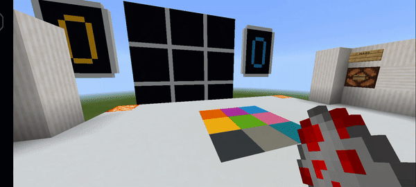
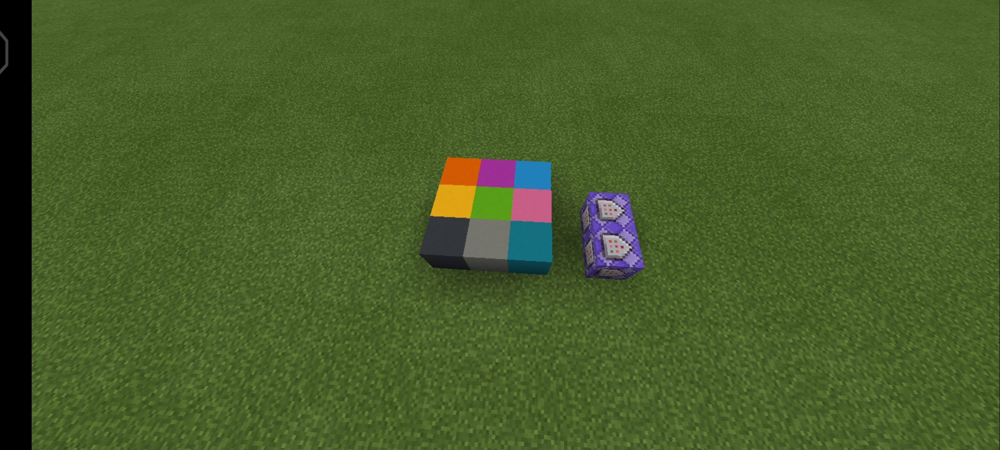
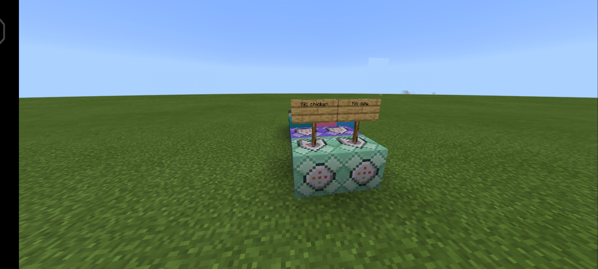
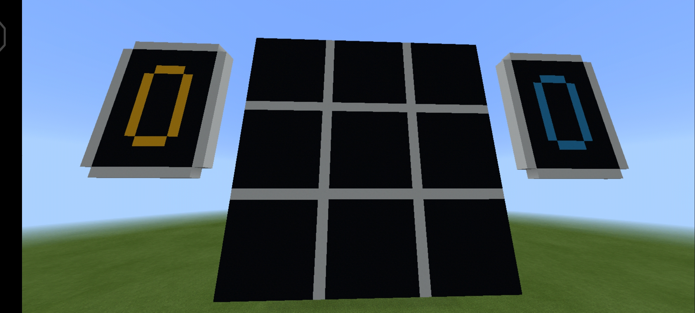
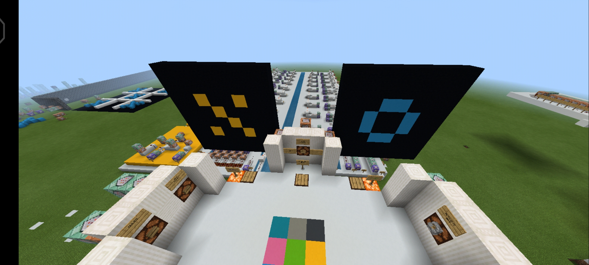

# Minecraft Bedrock TikTakToe Game



More images [extra folder](./media/extra)

# World
If you want to install the world you can download it in the `mcworld` folder and follow the `README.md` file to install it. Remmenber that the minecraft what I am using it's the bedrock version, not java.

# Rules
You must need a friend and one of them choose who is Player1 and Player2, the Player1 generate chickens that will be replaced to armor stand and Player2 generate cows and the same. For generate it you need the chicken or cow spawn egg and the one of them start the game generating the mob inside the 3x3 tiktaktoe square one by one and the first make a trial won the point. Every player need to win 5 points to win the game.

# Index

## Table of content

### Part I - Detect and Push
1. [Introduction](#introduction)
2. [Detect Block & Push Armor Stand](#detect-block)
3. [Kill Animal](#kill-animal)
4. [Generate easy select](#generate-villager)


# Part I - Detect and Push

## <a name="introduction"></a> 1. Introduction

Firstly, the tiktaktoe that we are going to create it will be double view, means that you have a table to manage and one for spectate. If you don't want to create the second 3x3 table you can skip the step.

The system are going to detect two players, **chicken** and **cow** (you can change it by another mob) generated from eggs, and then kill them and push one armor in the position according to the player.

## <a name="detect-block"></a> 2. Detect Block & Push Armor Stand

We are going to push an armor_stand in the position of the animal mob when the command detect it.
```
/execute @e[type=chicken,x=NUM_X,y=NUM_Y,z=NUM_Z,dx=2,dz=2] ~~~ [...]

NUM_X = 'The first block on position X'
NUM_Y = 'The first block on position y'
NUM_Z = 'The first block on position z'
```
Remmenber to put the blocks according the xyz position of the map, don't create the game in negatives positions like from 0 4 0 to -2 4 -2 (3x3 square)

The next syntax is summon the armor
```
/[...] summon armor_stand ~~~ Player1
```

The complete syntax is
```
/execute @e[type=chicken,x=NUM_X,y=NUM_Y,z=NUM_Z,dx=2,dz=2] ~~~ summon armor_stand ~~~ Player1
```

Now for the Player2 (cow, you can change it)
```
/execute @e[type=cow,x=NUM_X,y=NUM_Y,z=NUM_Z,dx=2,dz=2] ~~~ summon armor_stand ~~~ Player2
```

All of them in **repeat, always active**



## <a name="kill-animal"></a> 3. Kill Animal

Now we need to kill the animal generated from the egg
```
/kill @e[type=chicken]

/kill @e[type=cow]
```

If you want to kill only in one radius or range use the selector, or both combinated
```
@e[r=?]

@e[x=?,z=?,dx=?,dz=?]
```

All this command in **chain, conditional, always active. After their own repeat command_block like the picture below**




## <a name="generate-villager"></a> 4. Generate easy select

In this part we are goint to create the viewer, for spectate for your friends. Remmenber that this viewer it's optional, so if you don't want to create it you only need to skip the parts where it's that written **optional** in brackets. (Optional)



Don't forget to create the tokens for Player1 and Player2, only one, we are going to clone it. (Optional)




And finally the numbers for the scores 1 to 5. Please read the rules if you don't know what we are going to make with the scores (Optional)


------

Let's start showing in the viewer and generating the villagers. Why villagers? We need to create a different villager name to every villager when the user put one armor_stand. 

Like if you are Player1 and you generate a chicken in position 1 and the will be killed and changed to armor, at the same time we need to create a villager called Player1-1 (Or any name that you want to change it) and then for Player2 the same and for the rest of positions. Like Player2-3, Player1-9 (Not optional)

Start with the position 1 for Player1, first detect if the armor down it's a concrete 1 and the generate the villager (Not optional)
```
/execute @e[type=armor_stand,name=Player1] ~~~ detect ~~-1~ concrete 1 summon villager Player1-1 NUM_X NUM_Y NUM_Z
```

And then show it in the viewer